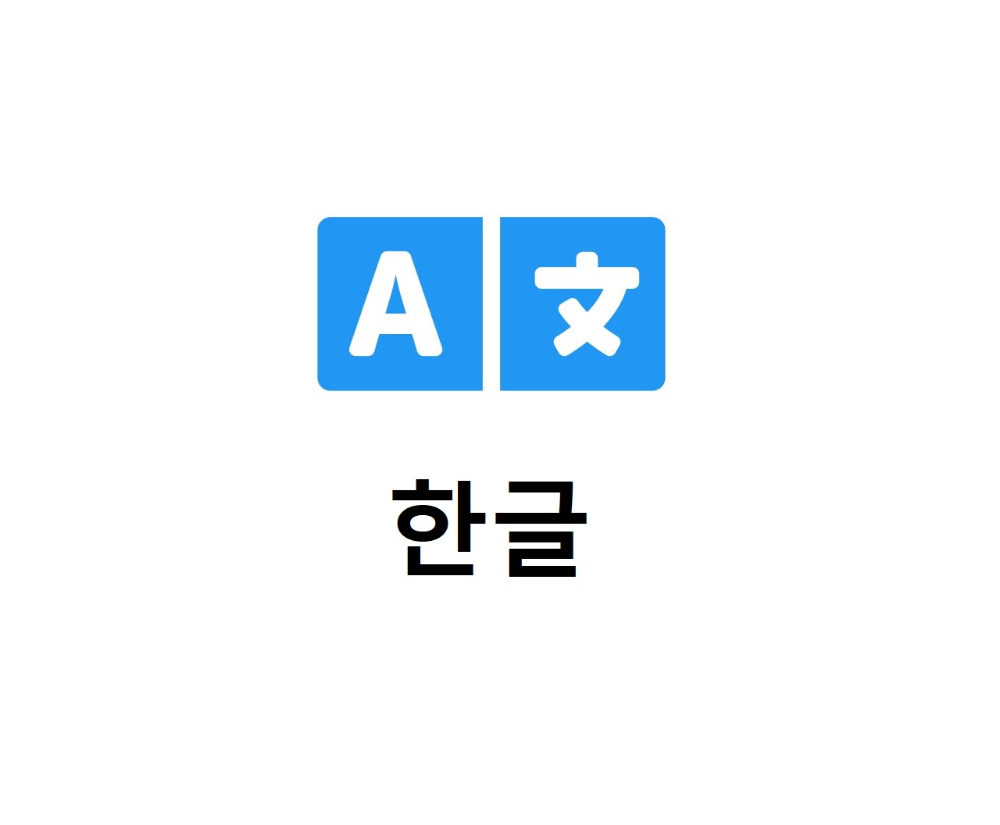

<p align="center"></p>
<h1 align="center">language-ko</h1>
<p align="center">WonderCMS 메뉴 한글 번역 플러그인</p>
<p align="center">번역: 누비 Nubi</p>

<br><br>

이 플러그인은 WonderCMS의 관리자 메뉴를 한글로 변경합니다. 

## 사용 방법
1. WonderCMS 사이트에 로그인
2. "Settings"에서 "Plugins" 클릭
3. 목록에서 플러그인을 찾아서 "install" 클릭

## 적용 원리

번역된 내용은 ko.csv 파일에 있습니다. 왜 CSV 파일이냐구요? 다른 CMS에서도 다 그렇게 하거든요!

아래와 같은 내용들이 적혀있을 거예요. 

```
SECTION NAME
	"> Some text","> 대충 텍스트"
```

파서는 두 값과 완전히 동일하지 않은 모든 줄을 건너뛰기 때문에, 텍스트의 번역이 그 텍스트를 포함하는 다른 번역에는 적용되지 않아요. 
모든 번역은 `preg_replace` 정규식이에요. 이게 다입니다! `>`와 `> ` 앞의 내용들로 번역할 내용을 찾아요. 

이렇게 적용될 경우, `> Security` 는 아래의 내용에 적용돼요.
```
<a href="#security" aria-controls="security" role="tab" data-toggle="tab" class="nav-link">Security</a>
```
그리고 아래의 내용들에는 적용되지 않아요.
```
<div class="btn-group w-50"><button type="submit" class="btn btn-success" name="betterSecurity" value="on">ON (warning: may break your website)</button></div>
<div class="btn-group w-50"><button type="submit" class="btn btn-danger" name="betterSecurity" value="off">OFF (reset htaccess to default)</button></div>
```


